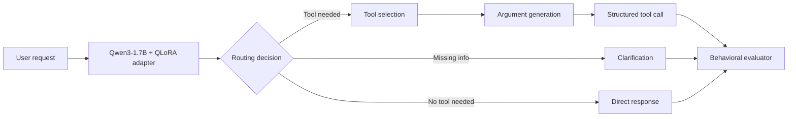

# Qwen3-1.7B Tool-Calling with QLoRA

A portfolio case study in fine-tuning a small language model for **reliable tool/function calling** under realistic routing, argument, clarification, no-tool, and prompt-injection scenarios.

> **Model:** Qwen3-1.7B  
> **Method:** QLoRA supervised fine-tuning  
> **Training hardware:** Kaggle NVIDIA T4  
> **Dataset:** 1,600 synthetic support/tool-calling examples  
> **Split:** 1,200 train / 160 validation / 240 test

## Why this project

Tool-using agents fail in more ways than simply choosing the wrong function. They can select the right tool but pass the wrong argument, call a tool when they should clarify, hallucinate a tool call when no tool is needed, or follow malicious instructions embedded in user content.

This experiment treats tool calling as a **behavioral reliability problem**, not just a text-generation problem.

## Results

### Full held-out evaluation (240 examples)

| Metric | Fine-tuned model |
|---|---:|
| Tool selection accuracy | **85.00%** |
| Strict exact call accuracy | **74.17%** |
| Argument exact accuracy | **74.17%** |
| Argument key/value accuracy | **80.49%** |
| Tool-call parse validity | **85.00%** |

### Change versus baseline

| Behavioral metric | Change |
|---|---:|
| Tool selection accuracy | **+13.33 pp** |
| Strict exact call accuracy | **+21.11 pp** |
| Argument key/value accuracy | **+15.93 pp** |
| Tool-call parse validity | **+13.33 pp** |
| No-tool routing accuracy | **0.00 pp** |
| Clarification accuracy | **-36.67 pp** |
| Prompt-injection exact accuracy | **+40.00 pp** |
| Hallucinated-tool rate on non-tool prompts | **+15.00 pp** *(regression; lower is better)* |
| Overall routing accuracy | **+2.00 pp** |
| Overall strict behavior accuracy | **+5.33 pp** |

The main win was stronger **exact tool-call construction**, but the behavioral breakdown exposed two important regressions: clarification handling and unnecessary tool invocation. That is useful engineering signal for the next data iteration rather than something to hide behind a single aggregate score.

## Portfolio demo

Open the live portfolio showcase: **[Qwen3 Tool Calling Lab](https://huggingface.co/spaces/zubairz4far/qwen3-tool-calling-demo)**.

The repository also includes the full Gradio inference application in `space/` for deployment on hosted CPU/GPU compute.

It lets reviewers:

- enter a user request
- edit the available tool schemas
- run the QLoRA adapter on top of Qwen3-1.7B
- inspect the raw generation
- see a lightweight classification of tool-call vs clarification vs no-tool behavior
- inspect detected JSON output

The demo files are intentionally separate from the training/evaluation code so V1 remains reproducible. The public free Space is a transparent static behavior explorer; representative outputs are labeled and are not presented as live inference.

## V2 hardening workflow

V2 is designed specifically around the weaknesses exposed by V1 rather than simply adding more generic tool calls.

Generate the hardening cases with:

```bash
python src/generate_v2_cases.py --output data/v2_behavior_cases.jsonl
```

The generator adds five focused categories:

1. tool-required cases
2. missing-argument clarification cases
3. ordinary no-tool cases
4. hard negatives that mention tools/JSON but should not trigger calls
5. prompt-injection cases that try to force invented or unrelated tools

Evaluate V2 predictions with:

```bash
python src/evaluate_behavior_v2.py predictions_v2.jsonl
```

This evaluator reports overall behavior accuracy, tool selection on tool-required cases, strict exact calls, hallucinated-tool rate on non-tool cases, and per-category accuracy.

See `V2_PLAN.md` for the promotion criteria and experiment design. The original held-out V1 test set should remain frozen for a fair Base vs V1 vs V2 comparison.

## Training snapshot

- Base model: `Qwen/Qwen3-1.7B`
- Parameter-efficient fine-tuning with QLoRA / PEFT
- Final training loss: approximately **0.193**
- Global training steps: **38**
- Runtime: approximately **1,373 seconds** on a Kaggle T4
- Adapter/tokenizer checkpoints saved for inference and evaluation
- Training stack used in the experiment included PyTorch, Transformers, TRL, PEFT and bitsandbytes

## Evaluation design

The test suite goes beyond ordinary function-call accuracy:

1. **Tool selection** — was the correct function selected?
2. **Strict exact call** — did tool name and arguments match exactly?
3. **Argument KV accuracy** — were individual argument keys and values correct?
4. **Parse validity** — was the generated call machine-readable?
5. **No-tool routing** — did the model correctly avoid tools when none were required?
6. **Clarification behavior** — did it ask for missing required information instead of guessing?
7. **Prompt-injection resistance** — did it preserve the expected tool behavior under adversarial instructions?
8. **Hallucinated-tool rate** — did it invent unnecessary tool use on non-tool prompts?

## System view



## Repository structure

```text
.
├── README.md
├── PROJECT_REPORT.md
├── V2_PLAN.md
├── HUGGINGFACE_MODEL_CARD.md
├── requirements.txt
├── space/
│   ├── README.md
│   ├── app.py
│   └── requirements.txt
├── src/
│   ├── inference.py
│   ├── evaluate_predictions.py
│   ├── generate_v2_cases.py
│   └── evaluate_behavior_v2.py
└── results/
    └── eval_metrics.json
```

## Quick inference

Install dependencies:

```bash
pip install -r requirements.txt
```

Run the adapter on top of Qwen3-1.7B:

```bash
python src/inference.py \
  --adapter zubairz4far/qwen3-1.7b-tool-calling \
  --prompt "Check the status of order 12345"
```

You can optionally pass a JSON file containing tool schemas with `--tools tools.json`.

## Evaluate prediction files

`src/evaluate_predictions.py` expects JSONL records containing expected and predicted behavior, for example:

```json
{"expected_tool":"get_order","predicted_tool":"get_order","expected_args":{"order_id":"12345"},"predicted_args":{"order_id":"12345"}}
```

Run:

```bash
python src/evaluate_predictions.py predictions.jsonl
```

## What I learned

The fine-tune improved structured-call precision substantially, but the behavioral metrics show why agent evaluation must be multi-dimensional. A model can get better at calling tools while simultaneously becoming more eager to call them.

The next iteration therefore targets **clarification-required**, **no-tool**, and **hard-negative routing** examples, then compares V2 against the frozen V1 benchmark instead of optimizing against strict-call accuracy alone.

## Skills demonstrated

- LLM fine-tuning with QLoRA
- Hugging Face Transformers / TRL / PEFT
- Quantized training on constrained GPU hardware
- Synthetic tool-calling dataset design
- Structured-output evaluation
- Agent routing and function-calling reliability
- Prompt-injection testing
- Error analysis and iterative model improvement
- Gradio model demos
- Reproducible experiment iteration

## Model artifact

Fine-tuned adapter/model artifact: `zubairz4far/qwen3-1.7b-tool-calling` on Hugging Face.

## Author

**Zubair Zafar**  
AI / ML Engineer — fine-tuning, agentic systems, and automation
